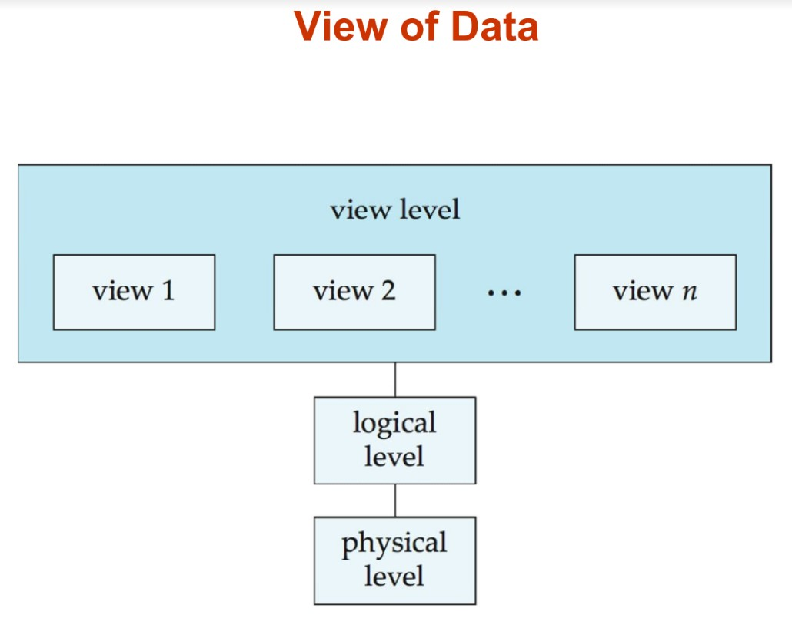

## *Clase 04/05/2022* :date:

### Capítulo 1. Introducción 

Database Management System (DBMS) 

Los DMBS contienen información de compañias particulares, es decir que brindan:

- Conjuntos de datos interrelacionados
- Un conjunto de programas para manejar estos datos
- Un ambiente conveniente y eficiente 

A su vez cuentan con:

- Sistemas de seguridad 
- Minería de datos 
- Ambiente apropiado (Interacción amigable)
- Sistemas de información

#### Aplicaciones que cuentan con Bases de datos

- Sistemas operativos: permiten la creación de usuarios, perfiles, licencias, datos, etc. 

- Transancciones entre bancos.

- Aerolineas: reservaciones, disponibilidad por horarios.

- Recursos humanos: nómina, contratos, etc.

En los primeros tiempos, las aplicaciones de bases de datos se creaban directamente sobre
sistemas de archivos. Sin embargo presentaban muchos incovenientes: 

- Redundancia e inconsistencia de datos.
- Dificultad para acceder a los datos.
- Aislamiento de datos: múltiples archivos y formatos.
- Problemas de integridad.
- Atomicidad de las actualizaciones: las fallas pueden dejar a la base de datos en un estado inconsistente con actualizaciones realizadas parcialmente, por ejemplo, la transferencia de fondos de una cuenta a otra debe realizarse por completo o no debe suceder en absoluto.
- Acceso simultáneo de múltiples usuarios:  los accesos simultáneos no controlados pueden generar inconsistencias. Ejemplo: dos personas leyendo un saldo (digamos 100) y actualizándolo, retirando dinero (digamos 50 cada uno) al mismo tiempo.

#### Cadenas de bloques

Son consideradas seguras ya que se trata de una estructura (mediante nodos) con apuntadores con claves dadas por una función Hash, a partir de un valor de entrada. 

#### Propiedades ACID

ACID es el conjunto de propiedades que garantizan que las transacciones de una Base de Datos se procesan de manera fiable.

*Atomicidad:* un cambio debe completarse en su totalidad o no modificar nada en absoluto.

*Consistencia:* cualquier cambio debe conducir de un estado válido de la base de datos a otro estado válido de acuerdo con las restricciones y el esquema de datos.

*Aislamiento (Isolation):* un cambio no debe afectar a otros cambios que se estén ejecutando al mismo tiempo sobre la base de datos.

*Durabilidad:* una vez completado el cambio, éste debe conservarse, aunque se produzcan fallos en la base de datos o el sistema completo.

#### Bases de datos No SQL

Se suelen utilizar cuando **no** se manejan transacciones. 

#### Capas/ Niveles de abstracción

#### Nivel de Vista 
Este nivel corresponde a resolver la pregunta ¿Qué vistas e informes son requeridos para la(s) aplicación(es) que serán soportadas por esta base de datos en particular?

Es decir que se encarga de decidir que datos de la BD se van a mostrar en el Frontend.

#### Nivel Lógico 

De acuerdo con los requisitos definidos en el nivel de vista, los datos se moldean de tal
de manera que cumplan con el paradigma y estándar elegido.  

Es decir corresponde al modelo de la BD de acuerdo a las necesidades del sistema, teniendo en cuenta las relaciones entre las entidades y los tipos de datos de los registros. 

#### Nivel Físico

Este nivel incluye las implicaciones computacionales de la capa lógica, se implementa a través de los propios comandos del SMBD seleccionado.

Se implementan elementos como:

- Estructuras
- Búsquedas rápidas
- Seguridad de la información
- Almacenamiento de la información 
- Las relaciones son garantizadas

#### Instancias y Esquemas
Similar a tipos y variables en lenguajes de programación. 

Esquema: estructura lógica de la BD. 

Instancia: el valor actual de la BD en un momento dato. 

Independencia de datos físicos: la capacidad de modificar el esquema físico sin cambiar el esquema lógico.

### Modelos de datos

Corresponden a una colección de herramientas que tienen como objetivo describir:

- Datos
- Relaciones entre los datos
- Semántica de los datos
- Restricciones de los datos(Constraints), para que todos actuen igual
- Estándares y paradigmas

La clasificación de una BD involucra los siguientes aspectos:

- Estructura
- Arquitectura
- Objeto de la BD

### Procesamiento de Lenguaje Natural (PLN/ NLP)

Es un campo de las ciencias de la computación, de la inteligencia artificial y de la lingüística que estudia las interacciones entre las computadoras y el lenguaje humano.

El PLN suele utilizar **datos no estructurados** es decir que no siguen una forma o regla concreta establecida, como campos de texto tipo TextArea, para añadir comentarios, diagnósticos de un paciente, etc. 

Mientras que los **datos estructurados** siguen una norma, un tipo de dato establecido, una longitud, como lo puede ser llenar un formulario con datos personales: fecha de nacimiento, nombres, apellidos, número de identificación, etc. 

