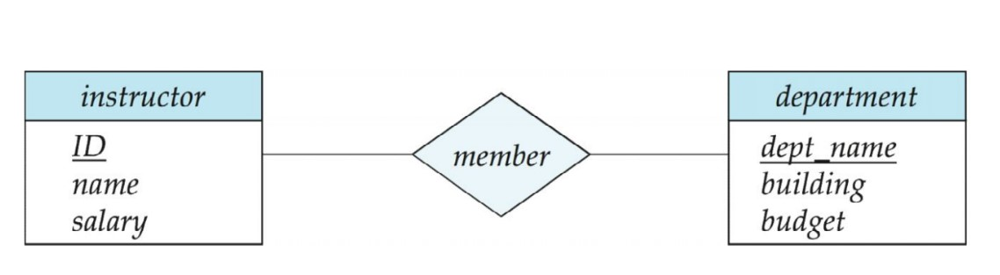
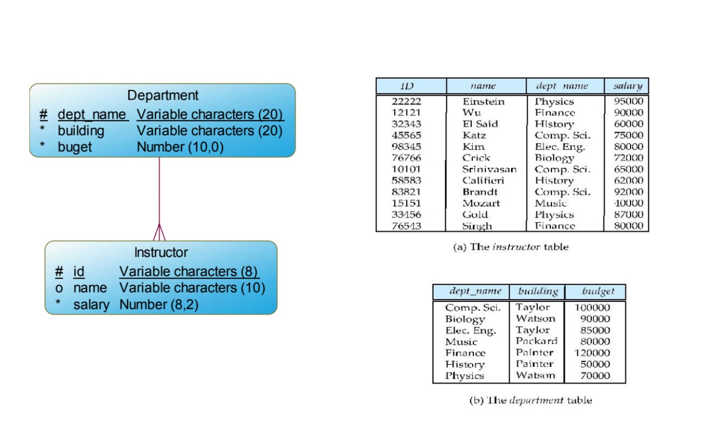
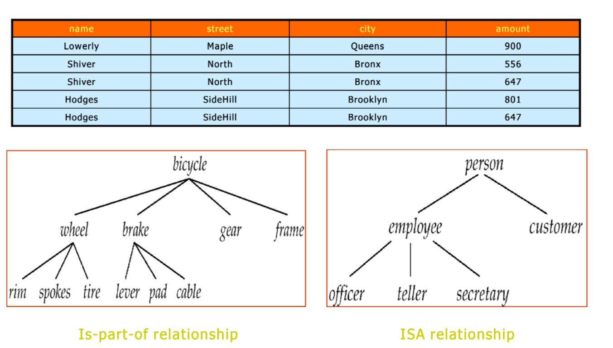
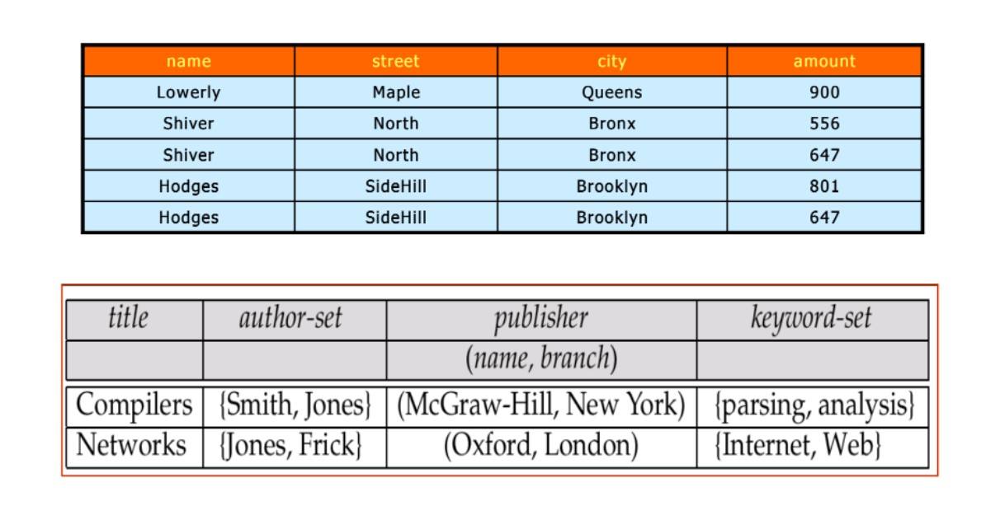
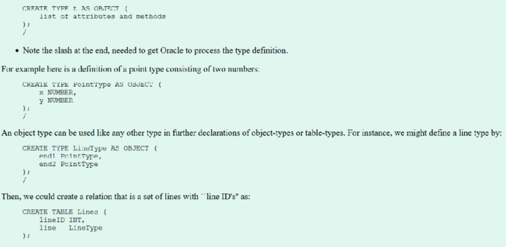
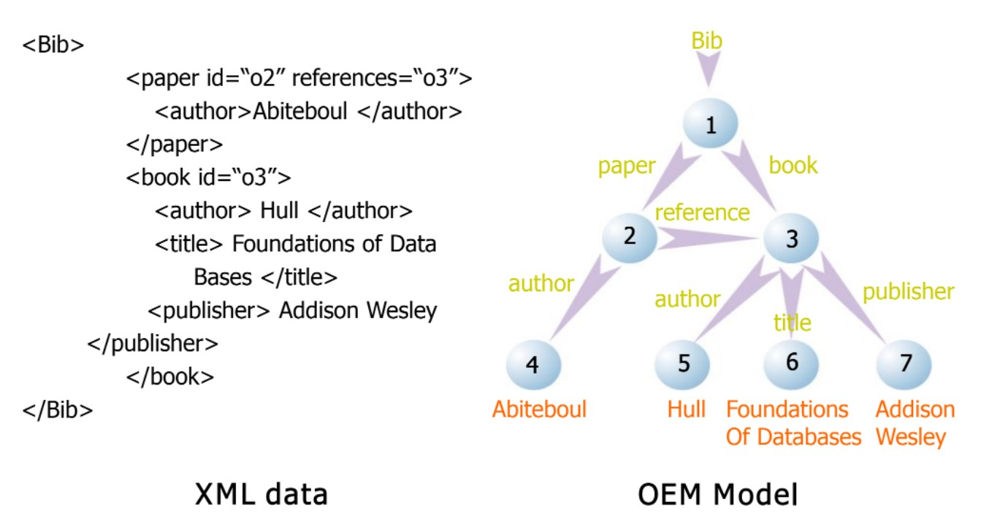
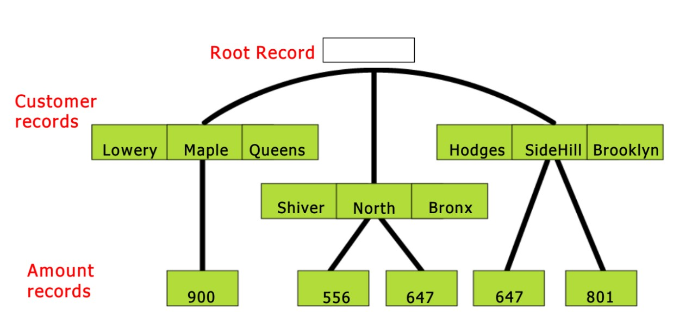

## *Clase 09/05/2022* :date:

Continuando con...

### Capítulo 1. Introducción :microscope:

### Clasificación de las Bases de datos de acuerdo al modelo de datos :herb:

Según el modelo se clasifica por:
- Estructura de los datos
- Paradigma

A su vez se encuentran otros aspectos de clasificación:
- Arquitectura
- Objeto/ fin de la BD

---

### Modelo de datos: Entidad-Relación   :construction_worker: :post_office:

**ORIGEN:** El modelo Entidad - Relación (ER) se presenta como parte de la metodología publicada a través del artículo “The Entity Relationship
Model - Toward A Unified View of Data” (1976) de Peter P. Chen, quien fue pionero de los requerimientos de los modelos computacionales. Este artículo es uno de los trabajos más citados en el campo de la informática.

Ha sido y sigue siendo la base no sólo para
metodologías para el desarrollo de sistemas sino también para el trabajo destinado a desarrollar herramientas CASE (Computer-Aided Software Engineering), las cuales permiten generar código a traves de diagramas.

El modelo E-R fue utilizado por IBM y posteriormente adoptado por la American National Standards Institute (ANSI) como metamodelo estándar.

Es la base de metodologías como Oracle, Microsoft, Unified Lenguaje de Modelado (UML), entre otros.

El modelo original entidad-relación (ER) propuesto por Peter P. Chen ha sufrido cambios y actualmente se ha desarrollado un modelo ampliado, que se conoce como: Modelo E/R Extendido.

Actualmente se utiliza como paso previo al modelo relacional.

Se considera innadecuado para datos desestructurados. 

### VENTAJAS DEL MODELO E/R :white_check_mark:

- Permite encontrar nuevas entidades a partir de las existentes y transformar relaciones multidimensionales a binarias.

- Transformar atributos a relaciones y viceversa (Normalización)

- Convertir el modelo en un "modelo relacional implementable" en un
motor de base de datos.

- Está muy extendido a nivel de academia.

- Es compatible con muchas de las herramientas para el diseño de bases de datos.

### DESVENTAJAS DEL MODELO E/R :x:

- **Exclusivo para datos relacionales**
- **Inadecuado para datos no estructurados**
- **No permite una integración con un motor de base de datos existente.**

---

### Modelo de datos: Relacional :bulb:

Gran parte de lo que es hoy el modelo relacional se publicó en 1970 en el artículo “A relational model of data for large shared data banks”, por el matemático inglés Edgar Frank Codd de la IBM laboratories en San José California.

Con esta publicación Codd crea un nuevo paradigma y **dirige la
modelo de datos hacia las necesidades de los usuarios, es decir, hacia las consultas.**

Codd también desarrolló el primer lenguaje relacional llamado ALPHA.

### Características del modelo relacional :pushpin:

- El modelo se basa en la teoría de conjuntos y la lógica de predicados.
- Define las relaciones como un conjunto de tuplas, donde cada tupla es una colección desordenada de diferentes elementos.
- Incluye la clave foránea para combinar dominios o relaciones.

- Utiliza el concepto de clave primaria, para distinguir una tupla de otra, es decir, un conjunto de elementos de la tupla que permite distinguir unívocamente una tupla de la otra.

**Codd propuso originalmente ocho operaciones:** cinco fundamentales
(restricción, proyección, producto cartesiano, unión, diferencia), y tres que se pueden expresar de lo anterior: (concatenación (join),
intersección y división). 
La restricción y la proyección son operaciones unarias (operan sobre una sola relación), mientras que las otras son binarias porque trabajan en pares de relaciones. 

Posteriormente IBM reacciona y construye el motor relacional R, con características de multiusuario y un lenguaje de consulta estructurado, **SEQUEL, que más tarde se llamará SQL (Structured Query Language)**.

Más o menos al mismo tiempo y basado en la investigación de Codd, **un empresario de Silicon Valley desarrolló el motor Oracle.**

Del modelo relacional propuesto por Codd, variaciones como
la de los británicos Richard Barker, Ian Palmer, Harry Ellis y otros aparecen. 

Esta notación fue desarrollada para una consultoría. 

Cuando Barker trabajó con Oracle, lo adoptó y publicó el
libro "Modelado de relación de entidad" como parte de una serie de libros del método CASE.

Esta notación fue y sigue siendo utilizada por las herramientas de modelado CASE de Oracle.

### VENTAJAS DEL MODELO RELACIONAL :white_check_mark:

- Proporciona herramientas que garantizan evitar la duplicidad de registros.

- Garantiza la integridad referencial, por lo que eliminar un registro implica borrar todos los registros relacionados.

- Favorece la estandarización al ser más comprensible y
aplicable.

-Más entendible y aplicable. 

### DESVENTAJAS DEL MODELO RELACIONAL :x:

- Exclusivo para datos relacionales
- No apto para datos no estructurados

“ANSI-American National Standards Institute” especifica los estándares que definen los elementos y características del modelo relacional.

---

### Modelo Orientado a Objetos :o: :white_circle: :red_circle:

Surge por la necesidad de manejar objetos multimediales.

Sistemas de gestión de bases de datos orientados a objetos (ODBMS) aparecieron en la década de 1980 con el crecimiento de los lenguajes orientados a objetos como C++.
- ODBMS amplían los lenguajes orientados a objetos con datos persistentes de forma transparente, control de concurrencia, recuperación de datos, consultas asociativas y otras capacidades.

Por otro lado, la comunidad de bases de datos observó que el modelo relacional no era adecuado para los dominios dirigidos a bases de conocimiento, aplicaciones georreferenciales y en general bases de datos no convencionales, que involucran objetos de datos complejos y
sus interacciones como el software. CAD/CAM, gráficos computarizados y recuperación de información.

En una base de datos orientada a objetos, los datos se representan como una colección de objetos que están organizados en clases y tienen valores complejos y métodos.

Aunque los modelos de bases de datos orientados a objetos permiten construir mejores estrucutas que el modelo base relacional, requieren que todos los datos se ajusten a un esquema predefinido.

- Los modelos de datos orientados a objetos son similares a los modelos semánticos en que
proporcionan mecanismos para construir datos complejos. Sin embargo difieren de estos en el sentido de que apoyan formas locales de comportamiento en una forma similar a los lenguajes de programación orientados a objetos.

**NOTA:** en bases orientadas a objetos se modela igual que la programacióm orientada a objetos. 

The Object Database Management Group (ODMG) especifica las normas y elementos que definen las características, tales como lograr persistencia en bases de datos orientadas a objetos.

OCL: Lenguaje de restricciones. 

### Object Database Management Group (ODMG) :office:

ODMG especifica los estándares que definen:
- El lenguaje de definición de objetos (ODL). CREATE
- El lenguaje de consulta de objetos (OQL). SELECT

### Object Definition Language (ODL) :pencil:

ODL es un lenguaje de definición de objetos, que permite definir objetos, tipos para sistemas compatibles con ODMG (ODL es el equivalente de DDL en lenguaje de definición de datos para DBMS).
- Define atributos y relaciones entre tipos, y especifica operaciones.

- La sintaxis ODL amplía el Common Object Request Broker
Arquitectura (CORBA) lenguaje de definición de interfaz (IDL). Sockets. 

#### Object Query Language (OQL) :musical_keyboard:

OQL es un lenguaje de tipo SQL declarativo que permite consultas eficientes en bases de datos orientadas a objetos, incluidas primitivas de alto nivel para objetos conjuntos y estructuras.

- Se basa en SQL-92 y proporciona un superconjunto de la sintaxis de SELECT declaración.

- OQL no tiene primitivas para modificar el estado de los objetos ya que  se pueden realizar modificaciones por medio de los métodos que poseen.

---

### Modelo de datos: Objeto-Relacional :link:

Amplia el modelo de datos relacionales al incluir la orientación a objetos y las construcciones para tratar con tipos de datos añadidos.

Permite que los atributos de las tuplas tengan tipos complejos, incluidos valores no atómicos como relaciones anidadas, asi como tipos de dato objeto.

Preserva los fundamentos relacionales, en particular el acceso declarativo a los datos,
mientras extiende el poder de modelado.

Proporciona compatibilidad ascendente con los lenguajes relacionales existentes.
Ejemplos:
- PostgreSql 
- Oracle

“ANSI-American National Standards Institute” especifica los estándares que definen
los elementos y características del Objeto - Modelo relacional.

### Modelo de datos Semiestructurado - XML 

### XML: Extensible Markup Language :truck:

Se realiza mediante etiquetas, más conocidas como tags. Cada etiqueta puede tener diferente cantidad de atributos. XML se conoce como lenguaje de "trasteo".

Definido por el Consorcio WWW (W3C. Originalmente pensado como un lenguaje de marcado de documentos, no como un lenguaje de base de datos.

La capacidad de especificar nuevas etiquetas y de crear estructuras de etiquetas anidadas en formato XML una excelente manera de intercambiar datos, no solo documentos.

XML se ha convertido en la base de todos los formatos de intercambio de datos de nueva generación.

Hay disponible una amplia variedad de herramientas para analizar, examinar y consultar archivos XML, documentos/datos. 

### Network Data Model :low_brightness:

